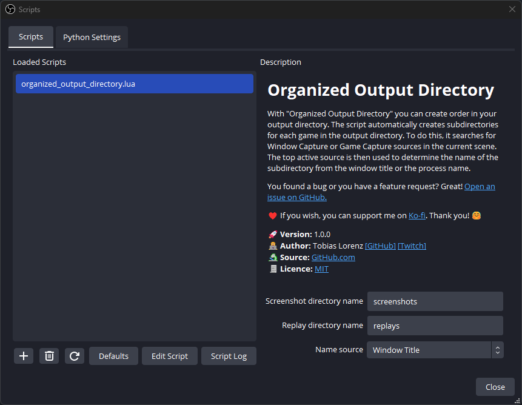

# Organized Output Directory
With "Organized Output Directory" you can create order in your output directory.
The script automatically creates subdirectories for each game in the output directory.
To do this, it searches for Window Capture or Game Capture sources in the current scene.
The last active and hooked source is then used to determine the name of the subdirectory from the window title or the process name.

❗This script only works with OBS v30.0.0 and newer versions.

# Known Issues / Planned Features
- Some kind of rule/wildcard/match system would be useful.

Some games/apps like Minecraft are a little tricky. The window title contains the current game version like `Minecraft 1.20.4` and the process name is something like `javaw.exe`. With a rule/wildcard/match system, we could change the name and remove the version from the window title, for example.

- Currently only Windows is supported. I would like to get the script running on Linux and MacOS as well.

- Maybe add an option to exclude some characters or only allow a certain character set

Some games like Battlefield 2042 have a window title like `Battlefield™ 2042`. Even if it is technically possible to use characters such as `™` in the file name, it is often not recommended, as it can happen that some software, especialy older ones, may only expect ASCII characters. The same applies to whitespaces.
